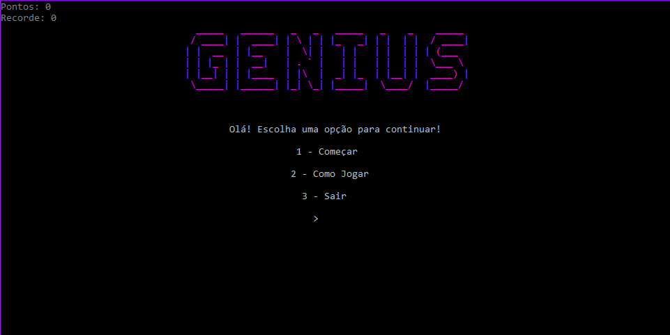
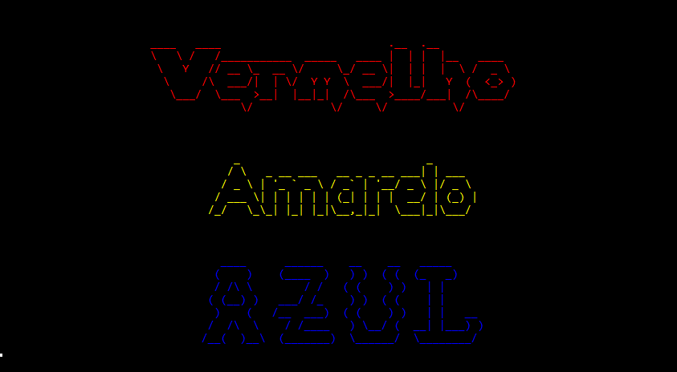
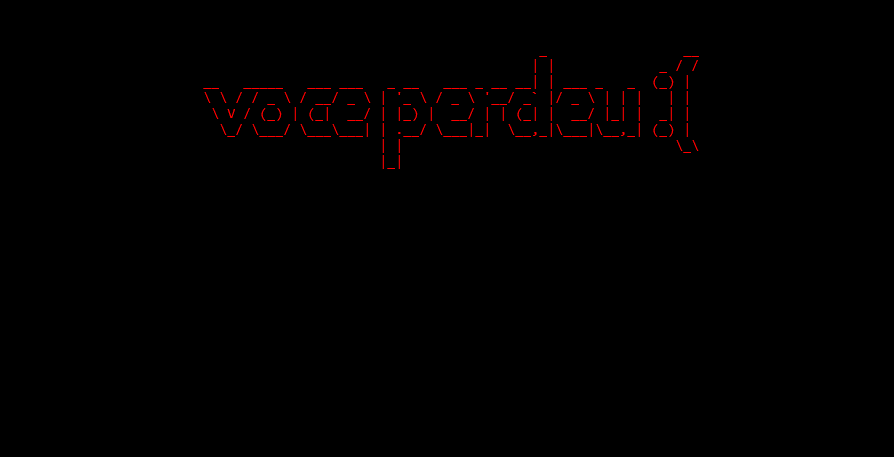

# <h1 align="center"> Genius </h1>

<h4 align="center"> This is the repository for the complete source codes and assets used in the game. You can use it for free to learn, research, modify or improve the game. The limit is your imagination! </h4>

<a href="#" target="_blank">Check this game at itch.io here! </a>

 

<h4 align="center"> This is a memory game with 15 rounds, where the player has to write correctly all the colors displayed on the screen.  </h4>

 Genius was made as a college project for Faculdade de Tecnologia de Americana, using the C language and the concept of LIFO structure. 

</img>

</img>

</img>

<h4 align="center"> Project </h4>
<h4 align="center"> C Developer </h4>

 Leonardo Nabarro Tonezer 

<h4 align="center"> Project Director, C Developer </h4> 

 Mileny Fernanda de Souza Clemente 

<h4 align="center"> DISCLAIMER: "Genius" is a personal project, developed for the "Advanced Programming" subject, coded "ILP202", at Faculdade de Tecnologia de Americana (FATEC-AM), located in Americana, São Paulo, Brazil. This project does NOT comercially profit today, has NOT comercially profited in the past, and will NOT comercially profit in the future. The owners and participants of this project do not sell, endorse the selling or receive any money for the copies of this project, strictly because there is copyrighted material from third parties developed into it. </h4>
<h4 align="center"> THE HEREBY PROJECT SHALL BE USED ONLY AND EXCLUSIVELY FOR RESEARCH PURPOSES.</h4>

<h3 align="center"> Copyright © 2023 Leonardo Nabarro Tonezer & Mileny Fernanda de Souza Clemente </h3>

 Apache License - Version 2.0

